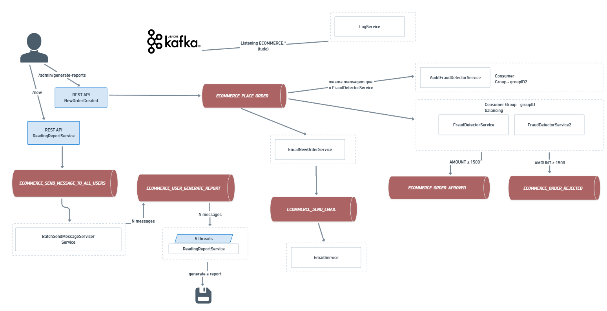

# Kafka

## Introdução
O Apache Kafka é uma plataforma de streaming distribuída que é capaz de lidar com trilhões de eventos por dia. Ele foi originalmente desenvolvido pelo LinkedIn e depois doado para a Apache Software Foundation, tornando-se um projeto de código aberto.

## Sobre o setup e comandos úteis

### Rodando no Docker as imagens do confluentinc:

Neste repositório, estou usando as imagens, que estão definidar no ```docker-compose.yml ```:
- confluentinc/cp-zookeeper:7.5.0
- confluentinc/cp-kafka:7.5.0
- obsidiandynamics/kafdrop:latest

### Testes dos comandos
Acesse seu container
```docker exec -it <ID_CONTAINER> /bin/bash```

Criando um novo tópico com nome ECOMMERCE_PLACE_ORDER com 1 partição:
```kafka-topics --create --topic ECOMMERCE_PLACE_ORDER --bootstrap-server localhost:9092 --partitions 3 --replication-factor 1```

Listando os tópicos existentes
```kafka-topics --list --bootstrap-server localhost:9092```

Produzindo mensagens
```kafka-console-producer --broker-list localhost:9092 --topic LOJA_NOVO_PEDIDO```

Consumindo mensagens desde o início da produção:
```kafka-console-consumer --bootstrap-server localhost:9092 --topic ECOMMERCE_SEND_EMAIL --from-beginning --group EmailService```

Apagar um tópico (perde as mensagens)

```kafka-topics --bootstrap-server localhost:9092 --delete --topic ECOMMERCE_PLACE_ORDER```

## Arquitetura
- **Producer**: é o responsável por publicar mensagens em um tópico.
- **Consumer**: é o responsável por consumir mensagens de um tópico.
- **Broker**: é o servidor que armazena as mensagens.
- **Zookeeper**: é o responsável por coordenar os brokers.
- **Topic**: é o local onde as mensagens são armazenadas.
- **Partition**: é uma divisão de um tópico.
- **Consumer Group**: é um grupo de consumidores que compartilham a leitura de um tópico.

Observações: 
- O número de partições de um tópico é definido no momento da criação do tópico. Se quisermos paralelismo de consumo, devemos ter mais de uma partição.
- O número de consumidores em um grupo de consumidores deve ser menor ou igual ao número de partições de um tópico.
- Se tivermos mais consumidores do que partições, alguns consumidores ficarão inativos.
- Se tivermos no mesmo groupId N consumidores, esses consumidores irão dividir a carga do tópico.
- Se o groupId for diferente, cada consumidor irá consumir todas as mensagens do tópico. Ocorre uma redundância de mensagens.


## Fluxo das mensagens no projeto


