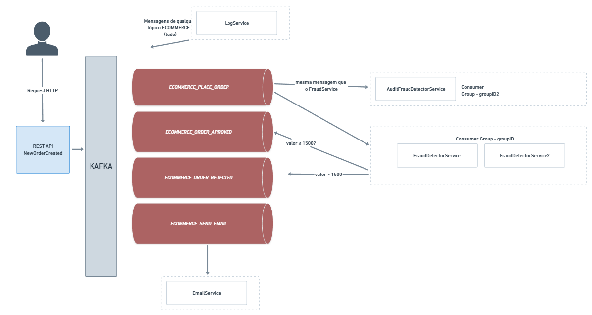

# Kafka

## Introdução
O Apache Kafka é uma plataforma de streaming distribuída que é capaz de lidar com trilhões de eventos por dia. Ele foi originalmente desenvolvido pelo LinkedIn e depois doado para a Apache Software Foundation, tornando-se um projeto de código aberto.

## Arquitetura
- **Producer**: é o responsável por publicar mensagens em um tópico.
- **Consumer**: é o responsável por consumir mensagens de um tópico.
- **Broker**: é o servidor que armazena as mensagens.
- **Zookeeper**: é o responsável por coordenar os brokers.
- **Topic**: é o local onde as mensagens são armazenadas.
- **Partition**: é uma divisão de um tópico.
- **Consumer Group**: é um grupo de consumidores que compartilham a leitura de um tópico.

Observações: 
- O número de partições de um tópico é definido no momento da criação do tópico. Se quisermos paralelismo de consumo, devemos ter mais de uma partição.
- O número de consumidores em um grupo de consumidores deve ser menor ou igual ao número de partições de um tópico.

## Fluxo das mensagens no projeto

